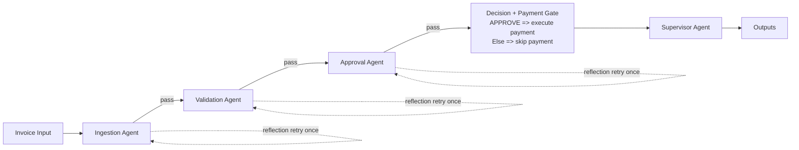

# Galatiq FDE Take-Home: Invoice Agentic Orchestration Solution

This submission is a runnable, end-to-end invoice operations MVP with agentic orchestration and product-level usability.

It processes invoices through:

1. Ingestion
2. Validation
3. Approval
4. Payment

Design goal: combine Grok-powered reasoning with deterministic controls so decisions are reliable, explainable, and reviewable.

## Quick Start for Reviewers

### 1) Create and activate virtual environment

From repo root:

```bash
python3 -m venv .venv
source .venv/bin/activate
pip install -r requirements.txt
```

### 2) Configure `.env` from template

```bash
cp .env.example .env
```

Set:

```bash
GROK_API_KEY=your_grok_api_key_here
GROK_MODEL=grok-3
```

### 3) Run via CLI

```bash
python main.py --invoice_path=data/invoices/invoice_1001.txt
```

No extra flags are required for normal execution. `inventory.db` is created/seeded automatically.

### 4) Run practical UI locally (runnable MVP)

Use two terminals from repo root.

Terminal 1 (backend):

```bash
source .venv/bin/activate
uvicorn app.api_server:app --reload --port 8000
```

Terminal 2 (frontend):

```bash
source .venv/bin/activate
cd ui
npm install
npm run dev
```

Open `http://localhost:5173`.

The UI is intentionally built as an operations-facing MVP workbench (not just a debug panel):

- upload/select invoice
- run full pipeline
- track stage timeline
- inspect extracted fields and inventory checks
- review plain-English rationale and flags
- apply manual override (`approve_and_pay` / `reject`) when needed

## Architecture Overview

LangGraph pipeline in `app/graph/builder.py`:

- `ingestion_agent` -> `ingest_reflection`
- `validation_agent` -> `validation_reflection`
- `approval_agent` -> `approval_reflection`
- `payment_agent` -> `supervisor_agent`

All stages share `PipelineState` and append to `audit_log` for full run traceability.

## Process Flow Diagram



## Deterministic-First Decisioning (LLM-Assisted, Not LLM-Only)

A key design choice is that the LLM does not unilaterally decide outcomes.

Decision flow:

1. Parse and normalize invoice data (file parsers + Grok-assisted extraction).
2. Run deterministic validation methods and tools:
   - SQLite inventory lookup
   - quantity and stock checks
   - totals reconciliation
   - due-date / payment-terms consistency checks
   - fuzzy candidate matching (`difflib.SequenceMatcher`) when exact item match is absent
3. Apply deterministic approval rules (`app/policies/approval_rules.py`).
4. Use Grok for rationale and reflection critique to improve explainability and quality.

This keeps business control logic stable and testable while still leveraging LLM strengths where they matter.

## Agent Responsibilities

### Ingestion (`app/agents/ingestion.py`)

- Parses `txt`, `json`, `csv`, `xml`, `pdf` into one canonical schema.
- Uses Grok extraction to improve handling of noisy/OCR-like inputs.

### Validation (`app/agents/validation.py`)

- Validates against local SQLite inventory (`inventory.db`).
- Checks quantity integrity, item existence, stock sufficiency, totals, and date/terms coherence.
- Emits structured `Issue` objects (`code`, `severity`, `stage`, `message`, `details`) so each flag is machine-readable and consistently rendered in policy logic and the UI.
- Keeps pass/fail and escalation decisions deterministic; Grok is used around this stage for reflection/critique quality checks, not as the primary rule engine.

### Approval (`app/agents/approval.py`)

- Applies deterministic policy mapping.
- Adds risk context (urgency language, non-standard payment instructions).
- Uses Grok to generate concise, auditable rationale text.

### Payment (`app/agents/payment.py`)

- Executes mock payment only if decision is `APPROVE`.
- Marks payment as `skipped` for `HUMAN_REVIEW`/`REJECT`.

### Supervisor (`app/agents/supervisor.py`)

- Runs end-state consistency checks.
- Assigns final status: `APPROVED_PAID`, `HUMAN_REVIEW_REQUIRED`, `REJECTED`, or `FAILED`.

## Reflection Loops (Bounded Self-Correction)

Reflection stages:

- `app/reflection/ingestion_reflect.py`
- `app/reflection/validation_reflect.py`
- `app/reflection/approval_reflect.py`

Each stage can request at most one retry, improving quality without unbounded loops.

## Decision Buckets and Plain-English Flag Meanings

UI policy guide lives in `ui/src/App.jsx`.

### 1) Reject Bucket (Critical)

Automatic rejection when critical integrity risk is detected.

- **Out of stock (`VAL_OUT_OF_STOCK`)**: requested item has zero available inventory.
- **Invalid quantity (`VAL_INVALID_QUANTITY`)**: quantity is invalid for fulfillment (for example, negative).

### 2) Human Review Bucket (Error / Warning / Uncertainty)

Manual decision required when evidence is inconsistent or risky.

- **Stock mismatch (`VAL_STOCK_MISMATCH`)**: request exceeds available stock.
- **Unknown item (`VAL_UNKNOWN_ITEM`)**: item not found in inventory.
- **Ambiguous item match (`VAL_AMBIGUOUS_ITEM_MATCH`)**: close fuzzy match found, but no safe auto-mapping.
- **Relative due date (`VAL_DUE_DATE_RELATIVE_LANGUAGE`)**: due date is non-deterministic wording like "ASAP".
- **Terms/date mismatch (`VAL_TERMS_DUE_MISMATCH`)**: due date conflicts with payment terms.
- **Uncertainty escalation (`uncertainty_requires_review`)**: a policy-level escalation used when data is not clearly wrong but not reliable enough for straight-through approval (for example ambiguous fuzzy item candidates, inconsistent totals, or date/terms ambiguity).
- **High-value escalation (`vp_threshold_exceeded`)**: amount crosses configured review threshold.
- **Urgency pressure language (`payment_pressure_language_detected`)**: coercive urgency detected in notes/terms.
- **Non-standard payment instructions (`nonstandard_payment_instruction`)**: risky payment pattern detected.

### 3) Auto-Approve Bucket

Automatic approval only when all are true:

- no critical/error escalations
- validation passes cleanly
- no blocking policy flags

Then payment executes and final status is `APPROVED_PAID`.

## Reviewer Checklist

For each run, check:

- stage timeline progression
- final status and payment status
- issue count and highest severity
- policy flags and approval rationale
- source preview and normalized extraction output

This makes each decision auditable from both engineering and business perspectives.

## Testing

```bash
pytest -q
```

Coverage includes integration flow behavior and key validation edge cases (date parsing, due-date policy consistency, invalid quantities).

## Risks and Tradeoffs

- Deterministic controls reduce false auto-pay risk.
- Conservative policy intentionally increases manual review on borderline cases.
- Bounded reflection retries improve quality while controlling runtime complexity.

## Improvements and Expansion Path

- **Adaptive fuzzy matching thresholds:** tune thresholds by vendor/item family and add confidence calibration from historical reviewer outcomes.
- **Learning from human overrides:** persist manual-review decisions and use them to improve future auto-mapping and policy tuning.
- **Richer validation coverage:** add unit price tolerance checks, duplicate invoice detection, vendor allowlists/blocklists, and tax/subtotal integrity checks.
- **Stronger document resilience:** improve OCR handling and table extraction for low-quality PDFs, including confidence scoring per extracted field.
- **Explainability quality:** provide field-level evidence links (which lines in source led to each issue/flag) in both API responses and UI.
- **Persistent run memory/record:** move run state and audit logs from in-memory runtime state to durable storage with replayable history.

## Final Summary

This project is positioned as:

- a technically strong multi-agent orchestration system, and
- a practical MVP product experience (CLI + UI) that a reviewer can run quickly and assess end-to-end.
